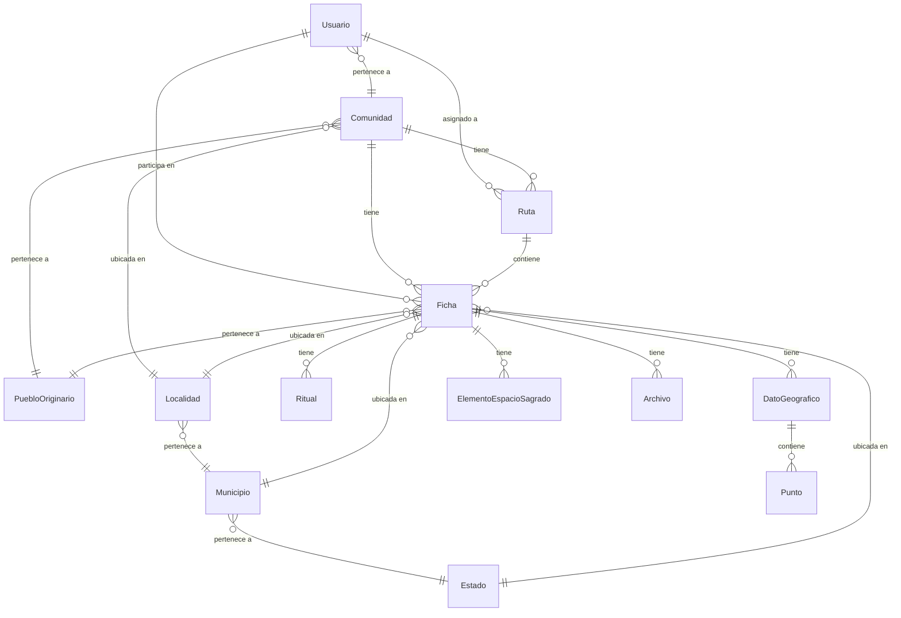

# 📄 Documento Técnico — Sistema INAH Polaris

## 1. Descripción General del Sistema

**Polaris** es un sistema web tipo **Progressive Web App (PWA)** desarrollado para el **Instituto Nacional de Antropología e Historia (INAH)** de México. Su propósito es digitalizar el proceso de registro, catalogación y gestión de **fichas de levantamiento de espacios sagrados y patrimonio cultural** de pueblos originarios.

### Problema que resuelve
Antes de Polaris, el levantamiento de fichas de espacios sagrados se hacía en papel. Esto causaba pérdida de información, dificultad de consulta, y falta de trazabilidad. Polaris digitaliza completamente este flujo, permite trabajo **offline en campo** y centraliza toda la información con control de acceso por roles.

### Usuarios del sistema

| Rol | Descripción | Permisos |
|---|---|---|
| **Administrador** | Gestiona todo el sistema | CRUD completo en todo, gestión de usuarios, logs de auditoría |
| **Comisionado** | Representante de comunidad, captura datos en campo | Crea/edita fichas, ve rutas asignadas |
| **Investigador** | Académico que analiza datos | Solo lectura de fichas, sube multimedia, ve asignaciones |
| **Ciudadano** | Público general | Solo ve el dashboard público |

---

## 2. Stack Tecnológico

### Backend
| Tecnología | Versión | Uso |
|---|---|---|
| **Python** | 3.14 | Lenguaje del backend |
| **Django** | 4.2 LTS | Framework web (ORM, admin, migrations) |
| **Django REST Framework** | 3.14+ | API RESTful |
| **Simple JWT** | — | Autenticación con tokens JWT |
| **PostgreSQL** | 17.9 | Base de datos relacional |
| **MinIO** | latest | Almacenamiento de objetos (archivos multimedia) compatible con S3 |
| **WeasyPrint** | 62+ | Generación de reportes PDF |

### Frontend
| Tecnología | Versión | Uso |
|---|---|---|
| **React** | 19.2 | Librería de UI (componentes) |
| **Vite** | 8.0 | Bundler y dev server |
| **React Router** | 7.6 | Navegación SPA |
| **Axios** | 1.7 | Cliente HTTP para la API |
| **Leaflet** | 1.9 | Mapas interactivos (OpenStreetMap) |
| **VitePWA + Workbox** | 1.3 | Service Worker y funcionalidad offline |
| **LocalForage** | 1.10 | IndexedDB para almacenamiento offline |
| **react-hot-toast** | 2.5 | Notificaciones |
| **react-icons** | 5.4 | Iconografía |

### Infraestructura
| Tecnología | Uso |
|---|---|
| **Docker** + **Docker Compose** | Contenedorización de todos los servicios |
| **Nginx** (producción) | Servidor web para el frontend estático |
| **Gunicorn** (producción) | Servidor WSGI para Django |

---

## 3. Arquitectura del Sistema

### 3.1 Arquitectura General: Cliente-Servidor Desacoplado

```
┌─────────────────────────────────────────────────────────┐
│                    CLIENTE (Browser/PWA)                 │
│  ┌──────────────────────────────────────────────────┐   │
│  │  React SPA (Vite)                                │   │
│  │  ┌──────────┐ ┌──────────┐ ┌────────────────┐   │   │
│  │  │ Contexts  │ │ Services │ │ Components/    │   │   │
│  │  │ (Auth,    │ │ (api.js, │ │ Pages          │   │   │
│  │  │  Theme)   │ │ fichas..)│ │                │   │   │
│  │  └──────────┘ └──────────┘ └────────────────┘   │   │
│  │  ┌──────────────────────────────────────────┐    │   │
│  │  │ Service Worker (Workbox) + IndexedDB     │    │   │
│  │  └──────────────────────────────────────────┘    │   │
│  └──────────────────────────────────────────────────┘   │
│                         │ HTTP/REST (JSON)               │
│                         ▼                                │
│  ┌──────────────────────────────────────────────────┐   │
│  │  Vite Proxy (/api → backend:8000)                │   │
│  └──────────────────────────────────────────────────┘   │
└─────────────────────────────────────────────────────────┘
                          │
                          ▼
┌─────────────────────────────────────────────────────────┐
│                    SERVIDOR (Docker)                     │
│  ┌─────────────────────┐  ┌──────────────────────────┐  │
│  │  Django REST API    │  │  PostgreSQL 17            │  │
│  │  (DRF + JWT)        │──│  (Datos relacionales)     │  │
│  │                     │  └──────────────────────────┘  │
│  │  apps/              │  ┌──────────────────────────┐  │
│  │  ├── core           │  │  MinIO (S3-compatible)   │  │
│  │  ├── cuentas        │──│  (Archivos multimedia)   │  │
│  │  ├── territorio     │  └──────────────────────────┘  │
│  │  ├── levantamiento  │                                │
│  │  ├── multimedia     │                                │
│  │  └── jornadas       │                                │
│  └─────────────────────┘                                │
└─────────────────────────────────────────────────────────┘
```

**¿Se respeta esta arquitectura?** ✅ **Sí.** El frontend y backend son proyectos completamente independientes que se comunican exclusivamente vía API REST con JSON. No hay templates de Django renderizados en el frontend. El único acoplamiento es el proxy de Vite que redirige `/api` al backend.

### 3.2 Arquitectura Backend: Django Apps Modulares (MTV)

Django sigue el patrón **MTV (Model-Template-View)**, adaptado a API REST como **Model-Serializer-View**:

```
backend/
├── core/                    ← Configuración Django (settings, urls, wsgi)
├── apps/
│   ├── core/                ← Modelo base abstracto + CRUD genérico
│   │   ├── models.py        → ModeloBaseAuditado (borrado lógico)
│   │   ├── views.py         → BaseCrudViewSet (soft delete interceptor)
│   │   ├── middleware.py     → AuditLogMiddleware
│   │   └── utils/           → Generación de PDFs, conversión UTM
│   │
│   ├── cuentas/             ← Gestión de usuarios y autenticación
│   │   ├── models.py        → Usuario (AbstractUser + roles)
│   │   ├── views.py         → UsuarioViewSet, AuditLogViewSet
│   │   ├── serializers.py   → UsuarioTokenSerializer (login JWT)
│   │   └── permissions.py   → EsAdministrador
│   │
│   ├── territorio/          ← Catálogos geográficos (INEGI)
│   │   ├── models.py        → Estado, Municipio, Localidad, Comunidad, PuebloOriginario
│   │   └── views.py         → CRUDs con filtros encadenados
│   │
│   ├── levantamiento/       ← Módulo principal de fichas
│   │   ├── models.py        → Ficha, Ritual, DatoGeografico, Punto, Elemento, Ruta
│   │   ├── views.py         → FichaViewSet, RutaViewSet (asignaciones, PDFs)
│   │   ├── serializers.py   → Serializers con campos display y anidados
│   │   └── permissions.py   → PuedeCRUDFichas (lectura/escritura por rol)
│   │
│   └── multimedia/          ← Archivos asociados a fichas
│       ├── models.py        → Archivo (FileField → MinIO) + signals
│       └── views.py         → ArchivoViewSet (MultiPartParser)
```

**¿Se respeta el patrón?** ✅ **Sí.** Cada app tiene una responsabilidad única y bien definida. Los modelos manejan la lógica de datos, los serializers la validación/transformación, y las views la lógica de negocio. Se usa herencia (BaseCrudViewSet) para reutilizar la lógica CRUD y el borrado lógico.

### 3.3 Arquitectura Frontend: Component-Based SPA

```
frontend/src/
├── main.jsx                 ← Punto de entrada (providers)
├── App.jsx                  ← Enrutamiento y guardias de acceso
├── index.css                ← Sistema de diseño global (variables CSS)
├── contexts/                ← Estado global (React Context API)
│   ├── AuthContext.jsx      → Autenticación, roles, permisos
│   └── ThemeContext.jsx     → Tema claro/oscuro
├── services/                ← Capa de comunicación con API
│   ├── api.js               → Instancia Axios + interceptors JWT
│   ├── fichas.js            → CRUD de fichas
│   ├── territorio.js        → Catálogos geográficos
│   ├── levantamiento.js     → Rituales, datos geográficos, elementos
│   ├── multimedia.js        → Subida de archivos
│   ├── rutas.js             → Gestión de rutas
│   └── usuarios.js          → Gestión de usuarios
├── hooks/                   ← Hooks personalizados
│   └── useOfflineSync.js    → Sincronización offline (IndexedDB)
├── components/              ← Componentes reutilizables
│   ├── Navbar.jsx           → Sidebar con navegación por rol
│   ├── DataTable.jsx        → Tabla de datos genérica
│   ├── Modal.jsx            → Modal reutilizable
│   ├── MultimediaSection.jsx→ Galería de archivos
│   ├── OfflineIndicator.jsx → Indicador de estado PWA
│   ├── ProtectedRoute.jsx   → Guardia de autenticación
│   └── ThemeToggle.jsx      → Switch claro/oscuro
├── pages/                   ← Páginas (vistas completas)
│   ├── LoginPage.jsx
│   ├── DashboardPage.jsx
│   ├── FichaListPage.jsx
│   ├── FichaFormPage.jsx    → Formulario wizard de 3 pasos
│   ├── FichaDetailPage.jsx
│   ├── RutasPage.jsx
│   ├── ComunidadesPage.jsx
│   ├── UsuariosPage.jsx
│   ├── MisAsignacionesPage.jsx
│   └── LogsPage.jsx
└── utils/
    └── utmConverter.js      → Conversión UTM ↔ Lat/Lng
```

**¿Se respeta la separación?** ✅ **Sí.** El frontend sigue el patrón de separación por capas:
- **Contexts** = estado global (sin Redux, usando Context API nativo)
- **Services** = comunicación con API (desacoplada de la UI)
- **Components** = bloques reutilizables
- **Pages** = composición de componentes por ruta
- **Hooks** = lógica reutilizable (offline sync)

---

## 4. Patrones de Diseño Implementados

### 4.1 Borrado Lógico (Soft Delete)
**Dónde:** `apps/core/models.py` → `ModeloBaseAuditado`

Todos los modelos heredan de `ModeloBaseAuditado` que incluye un campo `activo=True`. Al "eliminar" un registro, se marca como `activo=False` en vez de borrarlo físicamente. El `ActivoManager` filtra automáticamente los registros inactivos.

```python
class ModeloBaseAuditado(models.Model):
    fecha_creacion = models.DateTimeField(auto_now_add=True)
    fecha_actualizacion = models.DateTimeField(auto_now=True)
    activo = models.BooleanField(default=True)
    
    objects = ActivoManager()       # Solo registros activos
    all_objects = models.Manager()  # Todos los registros
    
    def soft_delete(self):
        self.activo = False
        self.save()
```

La interceptación se hace en `BaseCrudViewSet.perform_destroy()`, que llama a `soft_delete()` en vez de `delete()`.

### 4.2 CRUD Genérico con Herencia (Template Method)
**Dónde:** `apps/core/views.py` → `BaseCrudViewSet`

Todos los ViewSets heredan de `BaseCrudViewSet`, que extiende `ModelViewSet` de DRF. Esto centraliza el comportamiento de eliminación y permite que cada app solo defina su serializer y queryset.

### 4.3 Control de Acceso por Roles (RBAC)
**Dónde:** `apps/levantamiento/permissions.py` → `PuedeCRUDFichas`

Se implementa RBAC (Role-Based Access Control) a nivel de la API usando clases de permisos de DRF:

| Método HTTP | administrador | comisionado | investigador | ciudadano |
|---|:---:|:---:|:---:|:---:|
| GET (lectura) | ✅ | ✅ | ✅ | ❌ |
| POST (crear) | ✅ | ✅ | ❌ | ❌ |
| PUT/PATCH (editar) | ✅ | ✅ | ❌ | ❌ |
| DELETE (eliminar) | ✅ | ✅ | ❌ | ❌ |

En el frontend, el mismo esquema se replica en `AuthContext.jsx` con `puedeEditarFichas` y `puedeVerFichas`, y en `App.jsx` con `RolRoute`.

### 4.4 JWT con Refresh Token
**Dónde:** Backend: `core/urls.py` + Frontend: `services/api.js`

La autenticación usa **JSON Web Tokens** con par access/refresh:
1. Login → POST `/api/token/` → devuelve `{access, refresh, user}`
2. Cada request incluye `Authorization: Bearer <access_token>`
3. Si el access expira (401), el interceptor de Axios automáticamente usa el refresh token para obtener uno nuevo
4. Si el refresh también expiró → redirige al login

### 4.5 Proxy Pattern (Vite → Django)
**Dónde:** `vite.config.js`

El frontend usa URLs relativas (`/api/...`). En desarrollo, Vite intercepta estas rutas y las redirige al contenedor de Django (`http://backend:8000`). En producción, Nginx hace lo mismo. Esto mantiene la misma URL base independientemente del entorno.

### 4.6 Observer Pattern (Signals de Django)
**Dónde:** `apps/multimedia/models.py`

Cuando se sube o elimina un archivo multimedia, los signals `post_save` y `post_delete` actualizan automáticamente los contadores de la ficha asociada (`cantidad_fotos`, `cantidad_grabaciones`, `duracion_grabaciones`).

### 4.7 Middleware de Auditoría
**Dónde:** `apps/core/middleware.py` → `AuditLogMiddleware`

Intercepta todas las peticiones de escritura (POST, PUT, PATCH, DELETE) a la API y registra automáticamente quién hizo qué, cuándo, en qué ruta, y con qué resultado. Esto se ve en la página de Logs de Auditoría.

---

## 5. Modelo de Datos (Entidad-Relación)



### Tablas principales

| Modelo | Campos clave | Relaciones |
|---|---|---|
| **Ficha** | tipo_espacio_sagrado, nombre, historia, fecha, coordenadas | FK a Comunidad, Estado, Municipio, Localidad; M2M con Usuario (participantes), Ruta |
| **Ritual** | tipo, nombre, temporalidad, descripcion | FK a Ficha |
| **DatoGeografico** | tipo (punto/línea/polígono), área | FK a Ficha |
| **Punto** | zona_utm, este_x, norte_y, altura_z, margen_error | FK a DatoGeografico |
| **ElementoEspacioSagrado** | tipo (natural/transformado), forma, medidas | FK a Ficha |
| **Ruta** | nombre, descripcion | FK a Comunidad; M2M con Ficha y Usuario |
| **Archivo** | nombre, tipo, categoría, archivo (S3) | FK a Ficha y Usuario |
| **Comunidad** | nombre | FK a Localidad y PuebloOriginario |
| **Usuario** | username, rol, nombres, correo | FK a Comunidad (si es comisionado) |

---

## 6. Funcionalidad PWA (Offline-First)

### Arquitectura Offline

```
┌─────────────────────────────────────────┐
│          Navegador / App Instalada       │
│                                         │
│  ┌─────────────────────────────────┐    │
│  │  React App                      │    │
│  │  useOfflineSync() hook          │    │
│  │     ├─ isOnline (estado)        │    │
│  │     ├─ saveDraftOffline()       │    │
│  │     └─ syncPendingDrafts()      │    │
│  └────────────┬────────────────────┘    │
│               │                         │
│  ┌────────────▼────────────────────┐    │
│  │  IndexedDB (LocalForage)        │    │
│  │  Store: "PolarisPWA/fichas_     │    │
│  │         borrador"               │    │
│  │  Guarda fichas como JSON        │    │
│  └─────────────────────────────────┘    │
│                                         │
│  ┌─────────────────────────────────┐    │
│  │  Service Worker (Workbox)       │    │
│  │  ├─ Precache: JS, CSS, HTML     │    │
│  │  ├─ API: NetworkFirst           │    │
│  │  ├─ Tiles OSM: CacheFirst       │    │
│  │  └─ Fonts: CacheFirst           │    │
│  └─────────────────────────────────┘    │
└─────────────────────────────────────────┘
```

**Flujo offline:**
1. Usuario abre formulario de ficha sin conexión
2. Llena datos → botón cambia a "💾 Guardar Borrador (Offline)"
3. Los datos se guardan en IndexedDB vía `localforage`
4. Aparece indicador flotante rojo con conteo de borradores
5. Al recuperar conexión → indicador cambia a verde → "Sincronizar"
6. Los borradores se envían al backend vía la API normal
7. Al sincronizar exitosamente, se eliminan de IndexedDB

---

## 7. Flujo de Comunicación Frontend-Backend

### Login
```
[React LoginPage] → POST /api/token/ {username, password}
                  ← {access, refresh, user: {id, username, rol}}
                  → Guarda tokens en localStorage
                  → AuthContext.setUser(user)
                  → Redirige a Dashboard
```

### CRUD de Fichas
```
[FichaListPage]   → GET /api/levantamiento/fichas/
                  ← {results: [...], count: N, next, previous}

[FichaFormPage]   → POST /api/levantamiento/fichas/ {payload}
                  ← {id, numero_levantamiento, ...}
                  → Redirige a edición para agregar rituales, geo, elementos

[FichaDetailPage] → GET /api/levantamiento/fichas/{id}/
                  ← {todos los campos + display + nombres}
```

### Subida de Multimedia
```
[MultimediaSection] → POST /api/multimedia/archivos/ (FormData)
                      Headers: Content-Type: multipart/form-data
                    ← {id, nombre, tipo, url}
                    → Signal en Django actualiza contadores de la ficha
```

### Generación de PDF
```
[FichaDetailPage] → GET /api/levantamiento/fichas/{id}/generar_pdf/
                  ← Blob (application/pdf)
                  → downloadPdf() crea link temporal y descarga
```

---

## 8. Seguridad

| Mecanismo | Implementación |
|---|---|
| **Autenticación** | JWT (SimpleJWT) con access + refresh tokens |
| **Autorización** | RBAC con clases de permisos DRF por endpoint |
| **CORS** | `django-cors-headers` configurado para orígenes permitidos |
| **CSRF** | Deshabilitado para API (JWT ya protege) |
| **Contraseñas** | Hasheadas con PBKDF2 (Django default) + 4 validadores |
| **Borrado seguro** | Soft delete (nunca se pierden datos) |
| **Auditoría** | Middleware registra toda acción de escritura |
| **Protección de admin** | No se puede eliminar al único admin, ni cambiar su rol |
| **Validación de archivos** | Solo extensiones permitidas (.jpg, .png, .mp4, etc.) |

---

## 9. Infraestructura Docker

```yaml
services:
  db:        PostgreSQL 17.9  (puerto 5432)
  minio:     MinIO            (API: 9010, Console: 9001)
  backend:   Django + DRF     (puerto 8000)
  frontend:  React + Vite     (puerto 5173)
```

**Flujo de inicialización (entrypoint.sh):**
1. Ejecuta migraciones de Django (`migrate`)
2. Inicializa buckets de MinIO (`init_minio.py`)
3. Carga catálogo de territorio desde CSV del INEGI (`populate_territorio`)
4. Crea usuario administrador por defecto (`create_default_admin`)
5. Inicia el servidor Django

---

## 10. Verificación de Arquitecturas

### ¿Se respeta la arquitectura Cliente-Servidor?
✅ **Sí.** Frontend y backend son proyectos independientes, comunicados exclusivamente por API REST. No hay dependencias directas de código entre ellos. Cada uno tiene su propio Dockerfile y podría desplegarse por separado.

### ¿Se respeta el patrón MVC/MTV?
✅ **Sí.** Django usa Model-Serializer-ViewSet (adaptación de MTV para APIs):
- **Model** → Define la estructura de datos y reglas de negocio
- **Serializer** → Valida, transforma y serializa datos (reemplaza los templates)
- **ViewSet** → Maneja la lógica de las peticiones HTTP

### ¿Se respeta el patrón de Componentes de React?
✅ **Sí.** La UI está dividida en componentes reutilizables (`DataTable`, `Modal`, `MultimediaSection`) y páginas que los componen. El estado se maneja con Context API y hooks personalizados.

### ¿Se respeta la separación de responsabilidades?
✅ **Sí.** Cada capa tiene una función clara:
- `services/` → Solo comunicación HTTP
- `contexts/` → Solo estado global
- `hooks/` → Solo lógica reutilizable
- `components/` → Solo UI reutilizable
- `pages/` → Solo composición de vistas

### ¿Se respeta REST?
✅ **Sí.** Los endpoints siguen convenciones REST estándar:
- `GET /api/levantamiento/fichas/` → Listar
- `POST /api/levantamiento/fichas/` → Crear
- `GET /api/levantamiento/fichas/{id}/` → Detalle
- `PUT /api/levantamiento/fichas/{id}/` → Actualizar
- `DELETE /api/levantamiento/fichas/{id}/` → Eliminar (soft delete)
- `GET /api/levantamiento/fichas/{id}/generar_pdf/` → Acción personalizada

---

## 11. Preguntas Frecuentes (FAQ)

**P: ¿Por qué Django y no Node.js/Express para el backend?**
Django ofrece un ORM maduro, sistema de migraciones automáticas, admin panel integrado, y un ecosistema robusto (DRF, SimpleJWT) ideal para aplicaciones con modelos de datos complejos como las fichas de levantamiento.

**P: ¿Por qué React y no Angular o Vue?**
React tiene el ecosistema más grande, mejor soporte para PWA con VitePWA, y la arquitectura basada en componentes se adapta bien al formulario wizard de fichas que tiene múltiples secciones.

**P: ¿Por qué MinIO y no guardar archivos localmente?**
MinIO es compatible con la API de Amazon S3, lo que permite migrar a AWS S3 en producción sin cambiar código. Además, separa el almacenamiento de archivos del servidor de aplicación.

**P: ¿Por qué borrado lógico y no físico?**
Los datos de patrimonio cultural son sensibles y no deben perderse accidentalmente. El soft delete permite "restaurar" registros y mantener trazabilidad completa.

**P: ¿Cómo funciona la PWA offline?**
El Service Worker (Workbox) cachea los assets estáticos y las respuestas de API. Cuando no hay red, el usuario puede llenar fichas que se guardan en IndexedDB (vía LocalForage). Al reconectarse, se sincronizan con el backend.

**P: ¿Cómo se manejan las coordenadas geográficas?**
Las coordenadas se capturan en formato UTM (zona, este, norte) que es el estándar del INAH. El sistema convierte UTM ↔ Lat/Lng para visualización en mapas OpenStreetMap con Leaflet.

**P: ¿Qué pasa si dos usuarios editan la misma ficha?**
El sistema usa `fecha_actualizacion` (auto_now) para registrar la última modificación. No hay bloqueo optimista implementado; el último en guardar gana. Esto es aceptable dado que las fichas se capturan típicamente por un solo comisionado en campo.

**P: ¿Cómo se generan los PDFs?**
Usamos WeasyPrint que renderiza templates HTML de Django a PDF. El mapa estático se genera server-side convirtiendo coordenadas UTM a imágenes base64 con marcadores.

**P: ¿El sistema escala?**
Sí. Docker Compose facilita escalar horizontalmente. En producción se usa Gunicorn con 3+ workers y Nginx como reverse proxy. PostgreSQL y MinIO pueden migrarse a servicios administrados (RDS, S3).

**P: ¿Cómo se controlan los accesos?**
A tres niveles: (1) JWT para autenticación, (2) Clases de permisos DRF para autorización a nivel de endpoint, (3) Guardias de ruta en el frontend para visibilidad de la UI.
